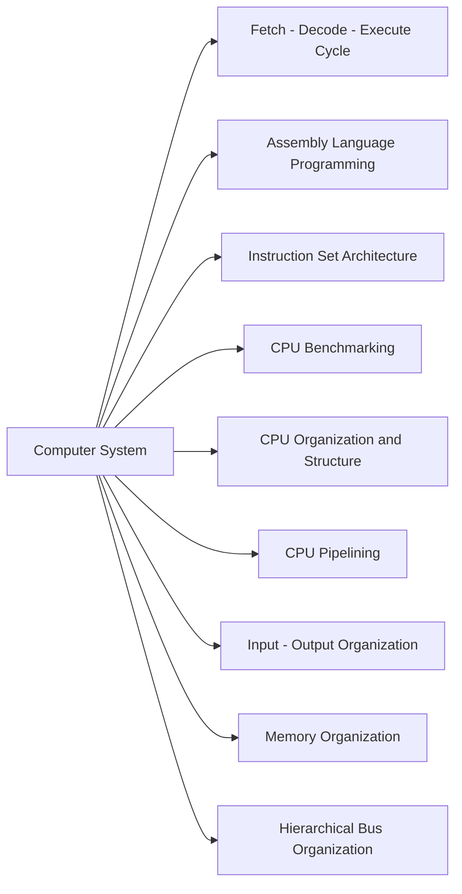

# 💦 Computer System 

## 📈 Summary

 
___

## 📚 List of contents

- [Introduction to Computer Organization and Architecture]() 
- [Fetch - Decode - Execute Cycle]() 
- [Assembly Language Programming with the Little Man Computer]() 
- [Instruction Set Architecture (ISA)]() 
- [CPU Benchmarking]() 
- [CPU Organization and Structure]() 
- [CPU Pipelining]() 
- [Input - Output Organization]() 
- [Memory Organization]() 
- [Hierarchical Bus Organization]() 

___

## 📚 Introduction to Computer Organization and Architecture

___

## 📚 Fetch - Decode - Execute Cycle

___

## 📚 Assembly Language Programming with the Little Man Computer

- What is the Little Man Computer ?

- Programming the Little Man Computer

- Fetch Decode Execute Cycle Explained using the Little Man Computer

___

## 📚 Instruction Set Architecture (ISA)

- Introduction to ISA

- CISC and RISC

- Instructions

- Number of Addressing

- Addressing Modes

___

## 📚 CPU Benchmarking

- Introduction to CPU Benchmarking

- Calculating CPU Time

- Understanding CPU Clock

___

## 📚 CPU Organization and Structure

- Introduction to CPU Structure

- CPU Registers

- Understanding CPU Interruptions

- Techniques to improve CPU Performance

___

## 📚 CPU Pipelining

- What is CPU Pipelining ?

- Resource Hazards

- Data Hazards

- Control Hazards and Branch Prediction

- Branch Prediction Strategies

- CPU Overclocking

___

## 📚 Input - Output Organization

- Introduction to I/O 

- I/O Mapping

- Asynchronous Data Transfer

___

## 📚 Memory Organization

- Introduction to Memory Hierarchy

- Deep dive into Computer Memory Hierarchy

- The Principle of Locality

- Memory HIT rate and MISS rate

- Cache Performance and Optimization

- Memory Technology

- DRAM Technology

- How a DRAM works ?

- DRAM Read Cycle Deeply Explained Step by Step

- SDRAM and DDR SDRAM Explained

___

## 📚 Hierarchical Bus Organization

- Introduction to Hierarchical Bus Structures 

- Single and Multiple Bus Implementations and Examples

- Bus Types, Timing and Additional Details

___

